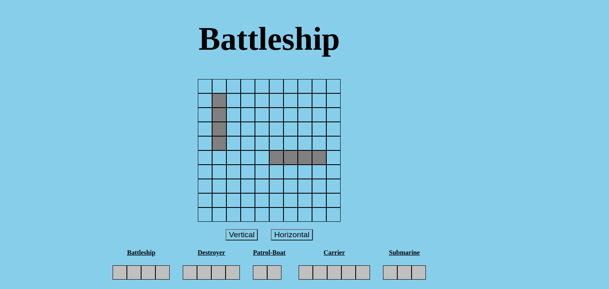
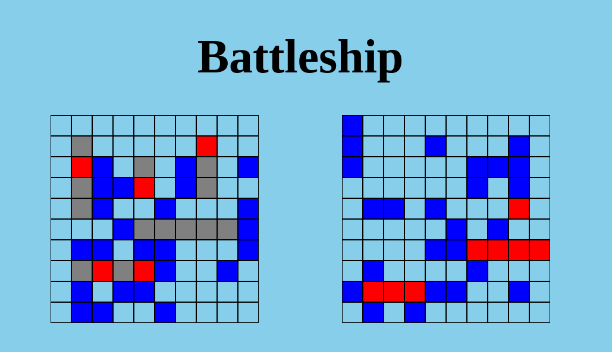
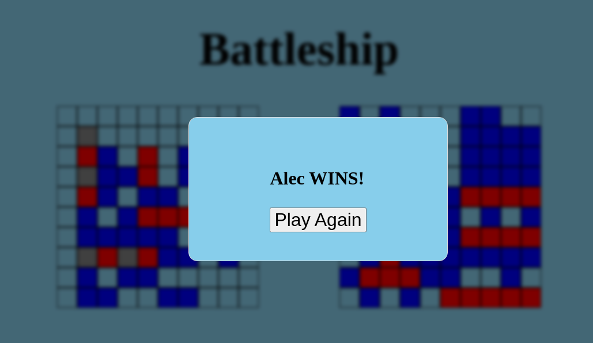

<h1>About This Project</h1> 
 Classic BattleShip game built with HTML, CSS, JavaScript, and webpack. Very challenging project and I developed a lot of grit and fortitude working through the project!

<br> 

<h1>What I learned</h1>
    <ul>
   <li>Learning how to write unit tests and implementing TDD best practices</li>
<li>Utilizing factory functions to efficiently create player objects</li>
<li>Implementing function methods such as the attack function to determine hit or miss coordinates, and identifying sunk ships</li>
<li>Enabling drag-and-drop functionality for placing ships on the gameboard</li>
<li>Developing logic to ensure the computer makes random attacks without hitting the same cell twice</li>
<li>Validating ship placements by users and the computer to ensure they remain within the board boundaries</li>
<li>Organizing code into modules for improved code structure and organization</li>
    </ul>


 <h1>Build With</h1>

 
 
  
 


<h1>Getting Started</h1>

To get project cloned locally: git clone git@github.com:alecnissen/Battleship.git

then ``` npm install ``` which will install all dependency's and packages.

<h1>Features</h1>

-Users can drag the ship objects onto the board. A hover class will be applied so user can see where the ship will be placed on the gameboard while ensuring that the ship placement is valid. Also user can change the direction to vertical or horizontal for ship placement



-Unit tests and TDD (Test Driven Development) to ensure code works as intended and to minimize errors and unwanted behavior

-When a hit is successful, color will change to red, and a miss will be colored blue 



-Code organized into modules for better organization and code structure

-When there is a winner, a modal will appear displaying the winner, with an option to restart the game




<h1>Acknowledgments</h1> Thank you to everyone within The Odin Project Curriculum from the bottom of my heart! Thank you to anyone who helped me in the discord channels. I promise to help others throughout this journey. 

<h1>Contact</h1>

Creator: Alec J Nissen 
<br>
E-Mail: alecnissen@yahoo.com
<br>
GitHub: https://github.com/alecnissen/Battleship
<br>
Live Link: https://alecnissen.github.io/Battleship/
